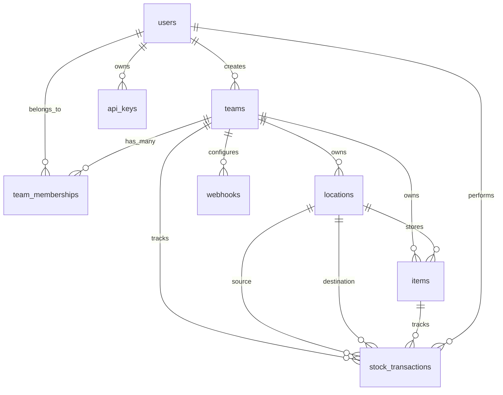

# Schema do Banco de Dados - PurpleStock

Este documento descreve a estrutura completa do banco de dados PostgreSQL utilizado pelo sistema de gerenciamento de estoque PurpleStock.

## 📋 Visão Geral

O banco de dados foi criado usando Ruby on Rails com Active Record e contém as seguintes tabelas principais:
- **Usuários e Autenticação**
- **Equipes e Membros**
- **Localizações**
- **Itens do Estoque**
- **Transações de Estoque**
- **Chaves de API**
- **Webhooks**

## 🗄️ Estrutura das Tabelas

### 1. **users** - Usuários do Sistema
Armazena informações dos usuários que têm acesso ao sistema.

| Campo | Tipo | Descrição | Restrições |
|-------|------|-----------|------------|
| `id` | bigint | Chave primária | NOT NULL, AUTO_INCREMENT |
| `email` | string | Email do usuário | NOT NULL, UNIQUE |
| `encrypted_password` | string | Senha criptografada | NOT NULL |
| `reset_password_token` | string | Token para reset de senha | UNIQUE |
| `reset_password_sent_at` | datetime | Data do envio do token | |
| `remember_created_at` | datetime | Data de "lembrar-me" | |
| `created_at` | datetime | Data de criação | NOT NULL |
| `updated_at` | datetime | Data de atualização | NOT NULL |

**Índices:**
- `index_users_on_email` (UNIQUE)
- `index_users_on_reset_password_token` (UNIQUE)

### 2. **teams** - Equipes/Empresas
Representa as empresas ou equipes que utilizam o sistema.

| Campo | Tipo | Descrição | Restrições |
|-------|------|-----------|------------|
| `id` | bigint | Chave primária | NOT NULL, AUTO_INCREMENT |
| `name` | string | Nome da equipe | NOT NULL |
| `notes` | text | Observações sobre a equipe | |
| `user_id` | bigint | ID do usuário criador | NOT NULL |
| `created_at` | datetime | Data de criação | NOT NULL |
| `updated_at` | datetime | Data de atualização | NOT NULL |

**Índices:**
- `index_teams_on_user_id`

**Chaves Estrangeiras:**
- `teams.user_id` → `users.id`

### 3. **team_memberships** - Membros das Equipes
Relaciona usuários com equipes e define seus papéis.

| Campo | Tipo | Descrição | Restrições |
|-------|------|-----------|------------|
| `id` | bigint | Chave primária | NOT NULL, AUTO_INCREMENT |
| `team_id` | bigint | ID da equipe | NOT NULL |
| `user_id` | bigint | ID do usuário | NOT NULL |
| `role` | integer | Papel do usuário na equipe | NOT NULL, DEFAULT: 0 |
| `created_at` | datetime | Data de criação | NOT NULL |
| `updated_at` | datetime | Data de atualização | NOT NULL |

**Índices:**
- `index_team_memberships_on_team_id`
- `index_team_memberships_on_user_id`
- `index_team_memberships_on_team_id_and_user_id` (UNIQUE)

**Chaves Estrangeiras:**
- `team_memberships.team_id` → `teams.id`
- `team_memberships.user_id` → `users.id`

### 4. **locations** - Localizações Físicas
Define os locais físicos onde os itens são armazenados.

| Campo | Tipo | Descrição | Restrições |
|-------|------|-----------|------------|
| `id` | bigint | Chave primária | NOT NULL, AUTO_INCREMENT |
| `name` | string | Nome da localização | NOT NULL |
| `description` | text | Descrição da localização | |
| `team_id` | bigint | ID da equipe proprietária | NOT NULL |
| `created_at` | datetime | Data de criação | NOT NULL |
| `updated_at` | datetime | Data de atualização | NOT NULL |

**Índices:**
- `index_locations_on_team_id`
- `index_locations_on_team_id_and_name` (UNIQUE)

**Chaves Estrangeiras:**
- `locations.team_id` → `teams.id`

### 5. **items** - Itens do Estoque
Armazena informações sobre os produtos/itens do estoque.

| Campo | Tipo | Descrição | Restrições |
|-------|------|-----------|------------|
| `id` | bigint | Chave primária | NOT NULL, AUTO_INCREMENT |
| `name` | string | Nome do item | |
| `sku` | string | Código SKU | |
| `barcode` | string | Código de barras | |
| `cost` | decimal(10,2) | Custo do item | |
| `price` | decimal(10,2) | Preço de venda | |
| `item_type` | string | Tipo do item | |
| `brand` | string | Marca do item | |
| `initial_quantity` | integer | Quantidade inicial | DEFAULT: 0 |
| `current_stock` | decimal(10,2) | Estoque atual | DEFAULT: 0.0 |
| `minimum_stock` | decimal(10,2) | Estoque mínimo | DEFAULT: 0.0 |
| `team_id` | bigint | ID da equipe proprietária | NOT NULL |
| `location_id` | bigint | ID da localização | |
| `created_at` | datetime | Data de criação | NOT NULL |
| `updated_at` | datetime | Data de atualização | NOT NULL |

**Índices:**
- `index_items_on_team_id`
- `index_items_on_location_id`
- `index_items_on_sku`
- `index_items_on_barcode`

**Chaves Estrangeiras:**
- `items.team_id` → `teams.id`
- `items.location_id` → `locations.id`

### 6. **stock_transactions** - Transações de Estoque
Registra todas as movimentações de estoque.

| Campo | Tipo | Descrição | Restrições |
|-------|------|-----------|------------|
| `id` | bigint | Chave primária | NOT NULL, AUTO_INCREMENT |
| `item_id` | bigint | ID do item | NOT NULL |
| `team_id` | bigint | ID da equipe | NOT NULL |
| `transaction_type` | enum | Tipo da transação | NOT NULL |
| `quantity` | decimal(10,2) | Quantidade movimentada | NOT NULL |
| `notes` | text | Observações | |
| `user_id` | bigint | ID do usuário que fez a transação | NOT NULL |
| `source_location_id` | bigint | Localização de origem | |
| `destination_location_id` | bigint | Localização de destino | |
| `created_at` | datetime | Data de criação | NOT NULL |
| `updated_at` | datetime | Data de atualização | NOT NULL |

**Tipos de Transação (ENUM):**
- `stock_in` - Entrada de estoque
- `stock_out` - Saída de estoque
- `adjust` - Ajuste de estoque
- `move` - Movimentação entre localizações
- `count` - Contagem de estoque

**Índices:**
- `index_stock_transactions_on_item_id`
- `index_stock_transactions_on_team_id`
- `index_stock_transactions_on_user_id`
- `index_stock_transactions_on_transaction_type`
- `index_stock_transactions_on_source_location_id`
- `index_stock_transactions_on_destination_location_id`
- `index_stock_transactions_on_item_id_and_created_at`

**Chaves Estrangeiras:**
- `stock_transactions.item_id` → `items.id`
- `stock_transactions.team_id` → `teams.id`
- `stock_transactions.user_id` → `users.id`
- `stock_transactions.source_location_id` → `locations.id`
- `stock_transactions.destination_location_id` → `locations.id`

**Constraints de Validação:**
- **Locais por tipo de transação:**
  - `move`: source_location_id e destination_location_id obrigatórios
  - `stock_in`: destination_location_id obrigatório, source_location_id nulo
  - `stock_out`: source_location_id obrigatório, destination_location_id nulo

- **Quantidade por tipo de transação:**
  - `stock_out`: quantidade deve ser ≤ 0
  - `stock_in`: quantidade deve ser ≥ 0

### 7. **api_keys** - Chaves de API
Gerencia as chaves de API para integração externa.

| Campo | Tipo | Descrição | Restrições |
|-------|------|-----------|------------|
| `id` | bigint | Chave primária | NOT NULL, AUTO_INCREMENT |
| `user_id` | bigint | ID do usuário proprietário | NOT NULL |
| `token` | string | Token da API | NOT NULL, UNIQUE |
| `created_at` | datetime | Data de criação | NOT NULL |
| `updated_at` | datetime | Data de atualização | NOT NULL |

**Índices:**
- `index_api_keys_on_user_id`
- `index_api_keys_on_token` (UNIQUE)

**Chaves Estrangeiras:**
- `api_keys.user_id` → `users.id`

### 8. **webhooks** - Webhooks
Configura webhooks para notificações externas.

| Campo | Tipo | Descrição | Restrições |
|-------|------|-----------|------------|
| `id` | bigint | Chave primária | NOT NULL, AUTO_INCREMENT |
| `url` | string | URL do webhook | |
| `event` | string | Tipo de evento | |
| `secret` | string | Chave secreta | |
| `team_id` | bigint | ID da equipe | NOT NULL |
| `created_at` | datetime | Data de criação | NOT NULL |
| `updated_at` | datetime | Data de atualização | NOT NULL |

**Índices:**
- `index_webhooks_on_team_id`

**Chaves Estrangeiras:**
- `webhooks.team_id` → `teams.id`

## 🔧 Extensões PostgreSQL

O banco utiliza a extensão `pg_catalog.plpgsql` para funcionalidades avançadas do PostgreSQL.

## 📊 Relacionamentos Principais



## 🎯 Casos de Uso Principais

### Gestão de Estoque
- **Entrada de produtos**: `stock_in` com `destination_location_id`
- **Saída de produtos**: `stock_out` com `source_location_id`
- **Movimentação**: `move` com origem e destino
- **Ajustes**: `adjust` para correções
- **Contagem**: `count` para inventários

### Controle de Acesso
- Usuários pertencem a equipes através de `team_memberships`
- Cada equipe tem seus próprios itens e localizações
- Chaves de API permitem integração externa

### Monitoramento
- Webhooks notificam eventos externos
- Histórico completo de transações
- Rastreamento de estoque atual vs mínimo

## 🔍 Consultas Úteis

### Estoque Atual por Item
```sql
SELECT i.name, i.current_stock, i.minimum_stock, l.name as location
FROM items i
LEFT JOIN locations l ON i.location_id = l.id
WHERE i.team_id = ?;
```

### Itens com Estoque Baixo
```sql
SELECT i.name, i.current_stock, i.minimum_stock
FROM items i
WHERE i.current_stock <= i.minimum_stock
AND i.team_id = ?;
```

### Transações Recentes
```sql
SELECT st.*, i.name as item_name, i.sku
FROM stock_transactions st
JOIN items i ON st.item_id = i.id
WHERE st.team_id = ?
ORDER BY st.created_at DESC
LIMIT 20;
```

### Valor Total do Estoque
```sql
SELECT SUM(current_stock * cost) as total_value
FROM items
WHERE team_id = ? AND current_stock > 0;
```

---

*Documentação gerada automaticamente a partir do schema Rails em 2025*
